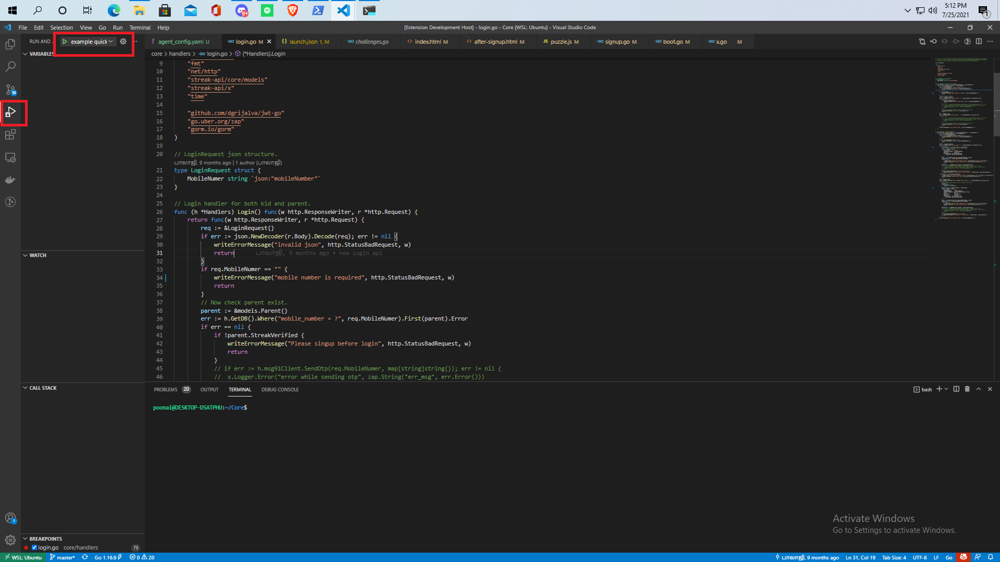
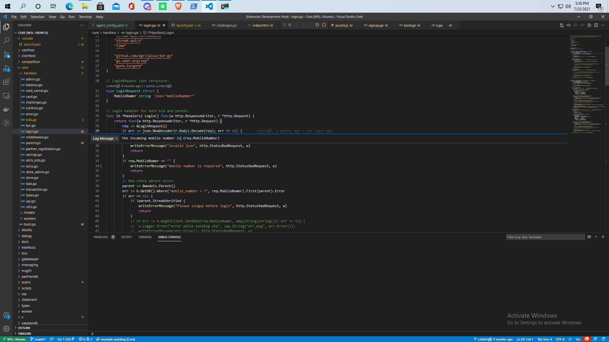

# Getting Started

### Step 1

create agent config with file name `agent_config.yaml`

```yaml
remote_manager_addr: "app.quicklog.dev:4003" ## manager addr. 
binary_path: "./example-api-service"
agent_token: "206b0626c5839c105db725b915ebc1fc8789bb7b" ## agent token
args: ["--service", "core"] ## args that needs to passed to the binary
```
*** For quicklog token generation check [Token Generation Docs](./TokenGeneration)*** 

### Step 2
Run the user program with quicklog

```shell
$ ls 
  agent_config.yaml example-api-service
$ quicklog agent
```


***For quicklog agent installation you can check [installation docs](./AttachingAgent)***

### Step 3

Configure vs code to connect to the agent.

Edit debugger launch config`.vscode/launch.json` to connect to the agent.
```json
{
    // Use IntelliSense to learn about possible attributes.
    // Hover to view descriptions of existing attributes.
    // For more information, visit: https://go.microsoft.com/fwlink/?linkid=830387
    "version": "0.2.0",
    "configurations": [
        {
            "type": "quicklog", // debugger extention type.
            "request": "launch",
            "name": "example quicklog", // name of the config
            "token": "206b0626c5839c105db725b915ebc1fc8789bb7b", // agent token
            "clientWorkspacePath": "/home/poonai/Core" // pwd of the workspace
        },
    ]
}
```

Click on debugger icon on the left and click play button to run the extention.



Attach the log point by right clicking on the line number where you want to attach log points. When the statement executes, the logs are streamed to the vscode debug console.

