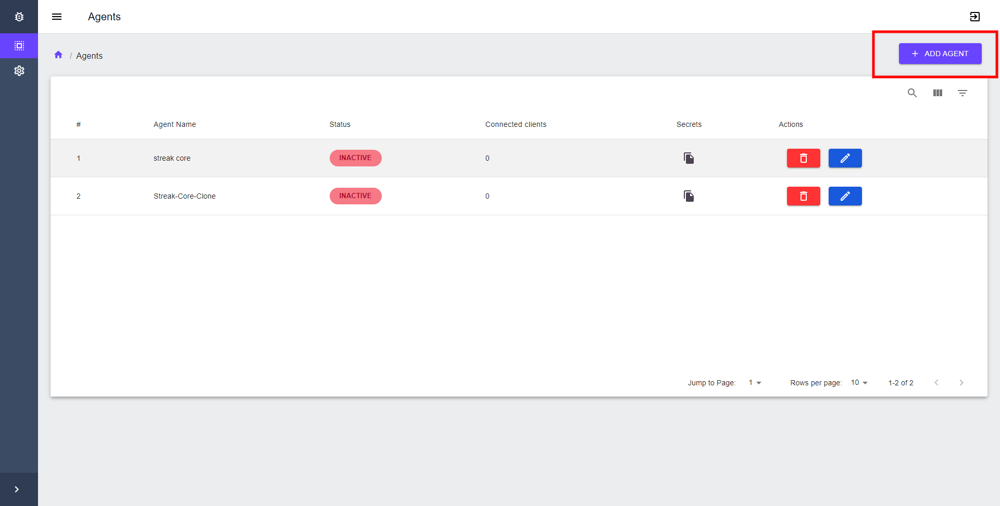
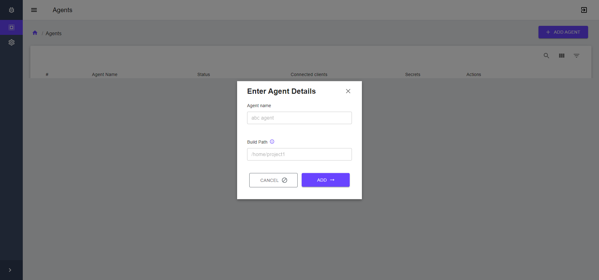
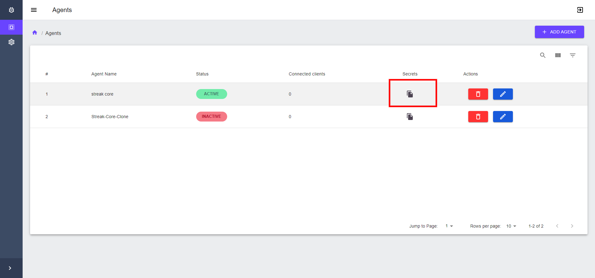

# Token Generation for agent

In order to use quicklog agent, you must have agent token which can be created using the dashboard.

If you are using the self hosted one, you can view dashboard on `http://localhost:7000` or if you are using hosted version, you can directly go to https://app.quicklog.dev to create an agent.

### Step 1

Login to your account and create agent by clicking Add Agent button on the right corner.

### Step 2
Enter the agent name and build path to create the agent.

***Note: build path of the program is path of the program where is been built. for eg: if you built the go pragram go build . in /home/poonai/ExampleService then your build path /home/poonai/ExampleService***

### Step 3 

Copy the agent token by clicking the clipboard icon.

